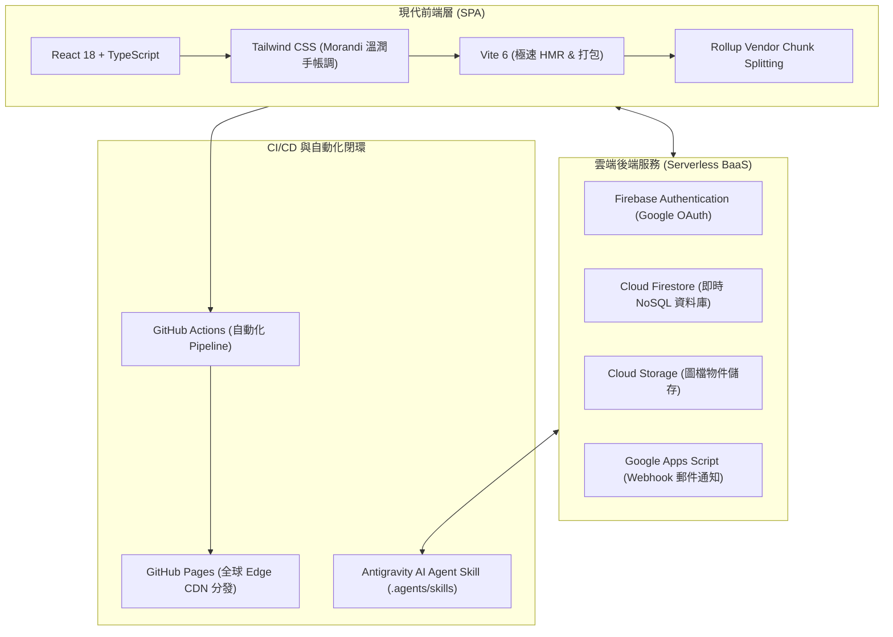

# 🌿 我們的小組手帳 Cozy Scrapbook

<div align="center">


<br/>

**凝聚聚會點子 · 定格歡笑片刻 · 傾聽夥伴心聲 · 專屬於成青小組的溫馨私密手帳空間**

👉 **[立即進入手帳 (線上正式環境)](https://hunk0724.github.io/streamside-tree-scrapbook/)** 👈

</div>

---

## 📖 專案願景 (Vision)

「小組手帳」是一個專為成青小組設計的私密協作平台。設計初衷是為了讓組員們在忙碌的生活與工作中，擁有一個有溫度、視覺溫潤（莫蘭迪綠、奶茶色、拍立得、紙膠帶質感）的線上天地。

在這裡，沒有繁雜的社交演算法，只有夥伴們的真心交流、聚會點子投票、活動相片紀錄以及持續進化的社群許願池。

---

## ✨ 核心特色與功能導覽 (Features)

### 💡 1. 每月聚會提案板 (Proposals)
- **提出新點子**：隨時發起聚會構想（如：秋季野餐、桌遊之夜、爬山踏青）。
- **即時愛心投票**：組員可點擊愛心為喜歡的活動投票，即時計算得票排行。
- **全員協同編輯**：每位核可組員皆可點擊「編輯/補充」，一起完善活動時間、地點與攜帶物品，並在卡片溫馨留存最後編輯者足跡（例如：`由 怡蓁 於 9/30 補充編輯`）。
- **專屬討論區**：每張提案卡片內建討論串，隨時留言交換意見。
- **最終定案標籤**：主責人或管理員可將獲勝方案設為「🌟 本月最終決定」。

### 📸 2. 活動紀錄與素材牆 (Records)
- **拍立得照片牆**：上傳聚會精彩瞬間，呈現手帳拍立得微傾斜隨機角度排版與手寫字體說明。
- **圖檔直傳雲端**：內建 Firebase Cloud Storage 上傳通道，支援各類常見照片格式。
- **共用素材與簡報**：可貼上聚會簡報、Google Drive 或共用文件外部連結，重要資源永不遺失。
- **多功能篩選**：支援一鍵切換「全部顯示」、「📸 拍立得照片」與「📎 共用素材」。

### 📝 3. 日常小碎片 (Updates)
- **生活隨手記**：分享日常工作近況、生活小感恩與代禱事項。
- **圖文混排**：支援文字分享與可選相片附圖，溫馨紀錄小組點滴。

### ✨ 4. 功能許願池 (Wishes & Feedback Loop)
- **社群發起許願**：想要手帳增加什麼新功能？大家一起來許願！
- **集氣點讚**：組員可對心儀的願望點擊「+1 集氣」，讓熱門需求優先被看見。
- **生命週期透明化**：清晰展示願望狀態（💡 許願中 ➔ 🛠️ 實現中 ➔ 🎉 已實現）。
- **🎉 功能上線日誌 (Release Notes)**：願望實現後，卡片會自動附上綠色改動摘要便條與版本號（如 `v1.1.0`），清楚知道該願望帶來了哪些功能改動。
- **💬 體驗回饋留言串**：組員可在已實現的願望下方留言回饋使用感受，形成持續迭代閉環。

### 🛡️ 5. 私密隱私與門禁機制 (Security Gatekeeper)
- **Google 帳號登入**：支援一鍵登入，防範匿名惡意機器人。
- **零信任審核閘門**：新用戶登入後需向管理員送出加入申請，經管理員於專屬審核面板核可後方能解鎖完整手帳。
- **即時通知聯動**：組員申請時自動非同步觸發 Google Apps Script (GAS) 郵件通知管理員。

---

## 🛠️ 技術架構與工程選型 (Tech Stack)

本專案採用現代前端工程化架構，兼顧開發效率、型別安全、載入性能與維護性：



- **前端核心**：React 18、TypeScript 5.7、Tailwind CSS 3.4
- **建置工具**：Vite 6.2（配置手動分包：React 核心與 Firebase SDK 分離打包，加速快取）
- **後端與儲存**：Firebase Auth、Cloud Firestore、Firebase Storage
- **自動化部屬 (CI/CD)**：GitHub Actions（每次 push 觸發 `npm ci` ➔ `tsc` 型別檢查 ➔ `vite build` ➔ 自動發布至 GitHub Pages）
- **AI 賦能閉環**：專案自帶 Antigravity Skill（`npm run check-wishes`），實現需求自動讀取與架構分析。

---

## 🚀 本地開發指南 (Local Development)

若您想在自己的電腦上運行或參與手帳開發，請依照以下步驟：

### 1. 前置需求
- 安裝 [Node.js](https://nodejs.org/) (建議版本 v20 或 v22 以上)
- 安裝 [Git](https://git-scm.com/)

### 2. 下載專案並安裝套件
```bash
# 複製專案倉庫
git clone https://github.com/Hunk0724/streamside-tree-scrapbook.git

# 進入專案目錄
cd streamside-tree-scrapbook

# 安裝依賴套件 (推薦使用 npm ci 確保版本完全一致)
npm ci
```

### 3. 啟動本機開發伺服器
```bash
npm run dev
```
啟動後打開瀏覽器訪問：`http://localhost:3000/streamside-tree-scrapbook/` 即可進行即時熱重載（HMR）開發。

### 4. 建置生產環境版本 (Build & Type Check)
```bash
npm run build
```
會同時執行 `tsc`（TypeScript 嚴格型別檢查）與 `vite build`（生產代碼最小化打包）。

### 5. 執行 Agent 許願池檢索腳本
```bash
npm run check-wishes
```
可在終端機快速獲取最新待實現的組員願望清單。

---

## 🤝 協作與貢獻準則 (Contribution & Rules)

本專案直接部署於生產環境，所有開發改動遵循嚴格的 [GEMINI.md](file:///d:/projects/river_tree_web/GEMINI.md) 協作紀律：
1. **需求理解**：深入確認問題與目標。
2. **方案評估**：提出可行架構與回滾方案。
3. **決策確認**：動手前必須經由確認方可修改。
4. **謹慎實作**：嚴守 TypeScript 型別定義與溫潤手帳視覺規範。
5. **部署前驗證**：本地 `npm run build` 0 錯誤，並經授權後方能執行 `git push`。

---

## 📜 版本發布歷史 (Release History)

- **`v1.1.0` (2026-09-30)**：
  - ✨ 新增「提案全員協同編輯」功能，並留存最後編輯者足跡。
  - 📝 許願池增加「功能上線改動摘要便條」與「版本標籤 (Version Tag)」。
  - 💬 許願池開放「組員使用體驗回饋留言串」。
  - 🤖 建立專案專屬 Antigravity Skill (`.agents/skills/check-wishes`)。
  - 🏷️ 正式導入專案語意化版本號（SemVer）。
- **`v1.0.0` (2026-09-30)**：
  - 🏗️ 完成現代化架構重構（由 2,200 行傳統 HTML 遷移至 Vite + React + TypeScript + Tailwind CSS）。
  - 🚀 建立 GitHub Actions CI/CD 自動化建置與 GitHub Pages 部署流程。
  - 🛡️ 實作零信任會員審核系統與 Firebase 規則保護。

---

<div align="center">
  <p>🌿 成青小組的小手帳 · 讓小組的每一天都更加美好 ✨</p>
</div>
